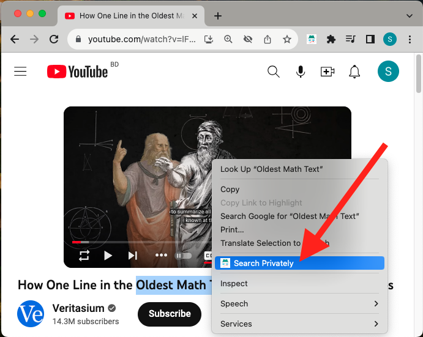

# Privy
Privy is a browser extension that can **open URL in private tab** and **search selected text in private tab**

## Open in Private Tab
Open the current tab URL in a private tab. Click the **Privy Button** on the top right corner of the browser.

|  | 
|:--:| 
| *Open Current Tab URL in a Private Tab* |

## Search in Private Tab
Search the selected text in a private tab. Select some texts in a webpage and choose **Search Privately** option from the context menu.

|  | 
|:--:| 
| *Search Selected Text in a Private Tab* |
