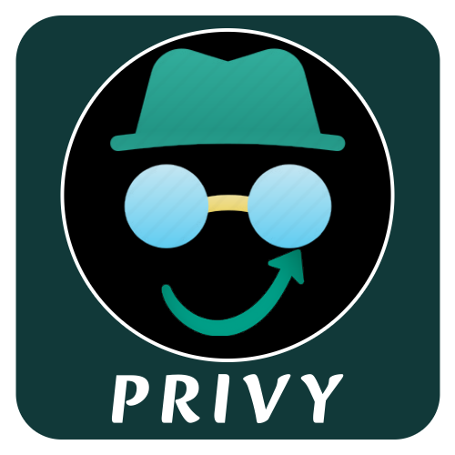

# 1. Privy
Privy is a browser extension that can **open URL in private tab** and **search selected text in private tab**

## 1.1. Open in Private Tab
Open the current tab URL in a private tab. Click the **Privy Button** on the top right corner of the browser.

|  | 
|:--:| 
| *Open Current Tab URL in a Private Tab* |

## 1.2. Search in Private Tab
Search the selected text in a private tab. Select some texts in a webpage and choose **Search Privately** option from the context menu.

|  | 
|:--:| 
| *Search Selected Text in a Private Tab* |

# 2. Installation

## 2.1 Manual Build Instructions for Privy (Node.js)
These instructions will guide you through setting up and building the Privy project, which uses a custom Node.js script.

### 2.1.1. Clone the Repository
First, clone the repository to your local machine using Git:

```git clone https://github.com/theashiq/Privy.git```

### 2.1.2. Navigate to the Project Directory
After cloning the repository, navigate into the project folder:

```cd Privy```

### 2.1.3. Ensure Node.js is Installed
Since this project uses a custom Node.js script, make sure you have Node.js installed on your system. You can verify if Node.js is installed by running:

```node -v```

If Node.js is not installed, download it from the official Node.js [website](https://nodejs.org/).

### 2.1.4. Run the Build Script
The project includes a custom Node.js build script that requires two arguments:

browser: Specify the target browser, either firefox or chromium.

version: Specify the version number for the extension.

To build the project, run the following command in your terminal:

```npm run build:<browser> <version>```

For example, to build for Firefox version 1.0.1, run:

```npm run build:firefox 1.0.1```

This will:

Clean or create a version-specific folder inside dist/.

Copy the necessary files from src/ into this folder.

Copy the correct manifest file for the selected browser.

After running the build script, you should see a success message like:

```✅ Build complete for firefox version 1.0.1. Files are in dist/privy.firefox.v.1.0.1/```

Similarly use the following command to build for chromium based browsers.

```npm run build:chromium 1.0.1```

### 2.1.5. Check the Output
The built files will be in the dist/ directory, specifically in a folder like privy.firefox.v.<version> or privy.chromium.v.<version>, depending on the browser and version you selected.

### 2.1.6. Deploy or Use the Built Files
Once the build is complete, you can:

Load the extension in your browser (e.g., Firefox or Chromium).

Deploy the built files as needed.

